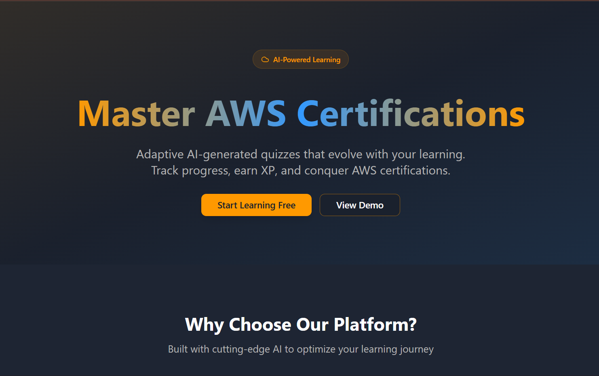
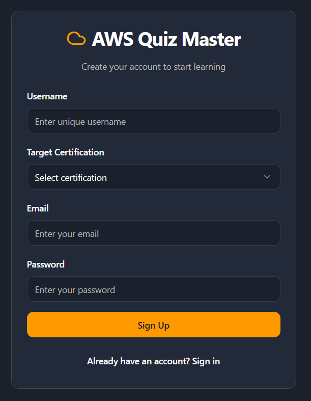
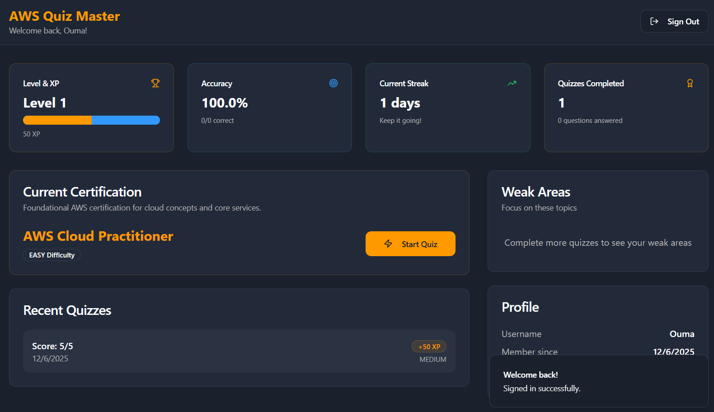
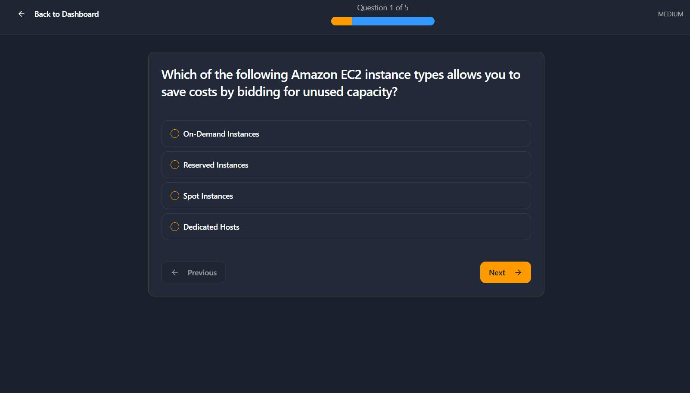
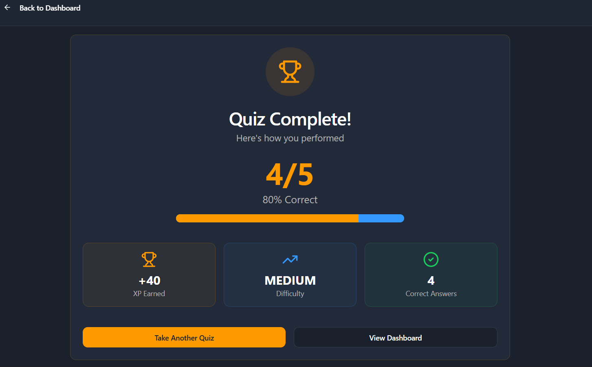
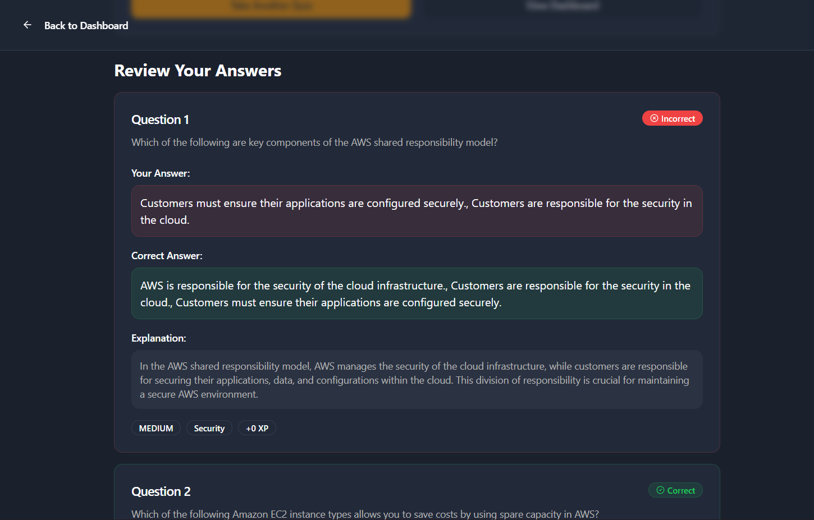
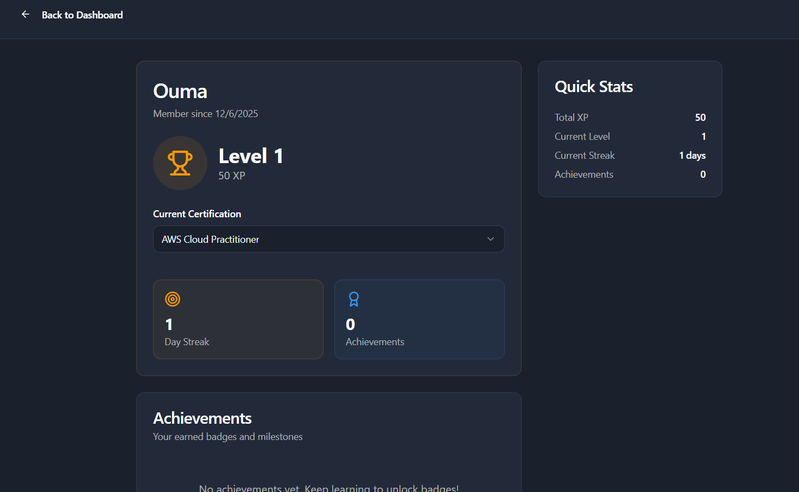

# AWS Mind Quest - Frontend

> A modern React-based quiz application for AWS certification preparation with adaptive learning features.

## 🚀 Overview

This is the **React frontend** for the AWS Mind Quest project - an intelligent quiz platform designed to help users prepare for AWS certification exams. The application features adaptive difficulty, personalized weak domain tracking, and comprehensive progress analytics.

## 📸 Screenshots

### Landing Page

*Clean and modern landing page with call-to-action*

### Authentication

*User registration with certification selection*

### Dashboard

*Personalized dashboard showing progress, stats, and weak domains*

### Quiz Interface

*Quiz generation with difficulty selection and weak domain focus*
*Interactive quiz interface with clean question display*

### Results & Analytics

*Detailed results with performance breakdown*

### User Profile

*User profile management and certification tracking*

## 🛠️ Tech Stack

- **Framework**: React 18
- **Build Tool**: Vite 5.4.19
- **Language**: TypeScript
- **UI Library**: Shadcn/UI (Radix UI primitives)
- **Styling**: Tailwind CSS
- **State Management**: React Hooks (useState, useEffect)
- **Routing**: React Router DOM
- **HTTP Client**: Custom API client with fetch API
- **Icons**: Lucide React
- **Notifications**: Sonner (Toast)

## ⚙️ Prerequisites

- **Node.js**: v18.0.0 or higher
- **npm** or **bun**: Latest version
- **Backend**: AWS Mind Quest FastAPI backend running on `http://localhost:8000`

## 👥 Authors

- **Oumayma O.** - [GitHub](https://github.com/Oumayma-O)

## 🔗 Related Repositories

- **Backend**: [AWS Mind Quest Backend](https://github.com/Oumayma-O/aws-mind-quest-backend) - FastAPI backend
